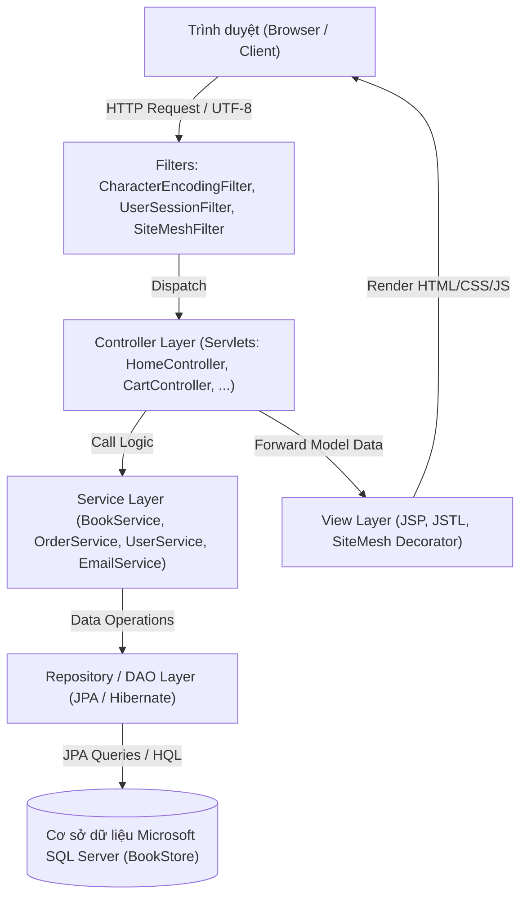
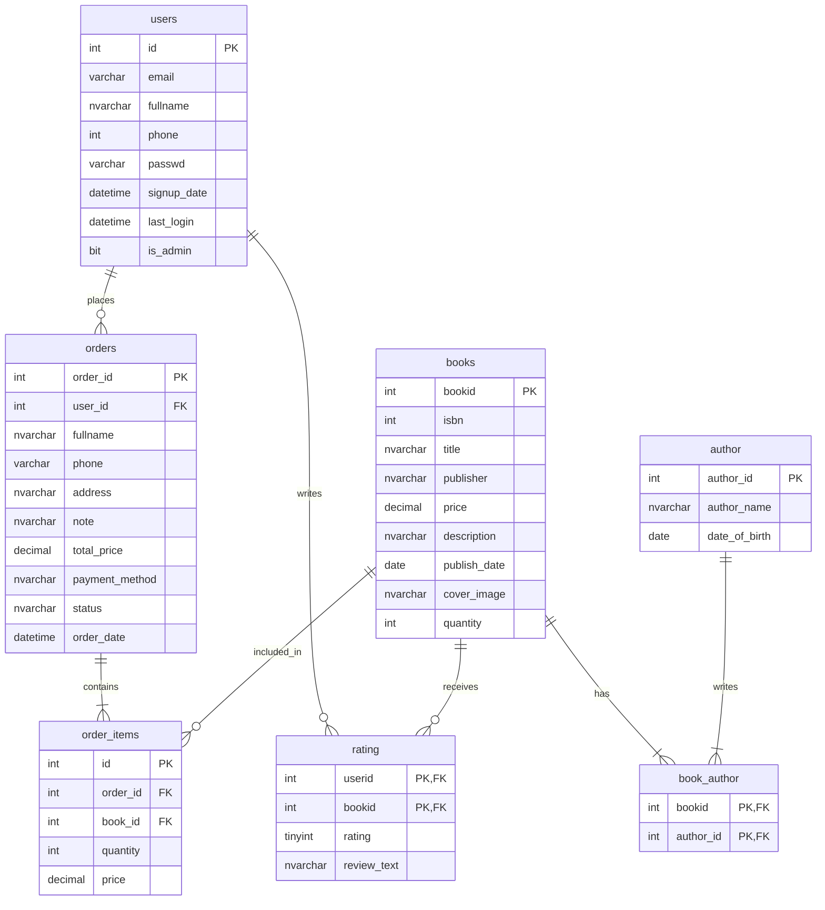

# 📚 Hệ Thống Website Quản Lý & Bán Sách Trực Tuyến (BookVerse)

<div align="center">


<br/>

**DỰ ÁN BÀI TẬP LỚN / BÀI TẬP THỰC HÀNH - ĐỀ SỐ 1**  
**Học phần:** Lập trình Web với Java (Java Web Application)  
**Trường Đại học Sư phạm Kỹ thuật TP.HCM (HCMUTE)**

</div>

---

## 👨‍💻 Thông Tin Sinh Viên Thực Hiện

* **Họ và tên:** Trương Quốc Duy
* **Mã số sinh viên (MSSV):** `24133009`
* **Email:** [24133009@student.hcmute.edu.vn](mailto:24133009@student.hcmute.edu.vn)
* **Đề tài:** **Đề 1 - Hệ thống Website Quản lý & Bán Sách Trực Tuyến**
* **Kho lưu trữ (Repository):** [24133009-ops/BT11](https://github.com/24133009-ops/BT11)

---

## 📖 Giới Thiệu Dự Án

**BookVerse** là ứng dụng web thương mại điện tử chuyên cung cấp và quản lý sách trực tuyến được xây dựng trên nền tảng **Java EE (JSP/Servlet)** kết hợp kiến trúc **MVC (Model-View-Controller)**, công nghệ ORM **Hibernate / JPA 2.2** và hệ quản trị cơ sở dữ liệu **Microsoft SQL Server**.

Hệ thống cung cấp trải nghiệm mua sắm hiện đại cho khách hàng và bộ công cụ quản trị tinh gọn cho người quản lý, hỗ trợ đầy đủ quy trình xác thực tài khoản qua **mã OTP gửi về Email**, quản lý giỏ hàng động, đặt hàng và **theo dõi đơn hàng qua 8 trạng thái tiêu chuẩn** của đề bài.

---

## 🌟 Tính Năng Nổi Bật

### 1. Phân Hệ Khách Hàng (User / Client Portal)
* **Trang chủ & Danh mục sản phẩm (`/home`):**
  * Giao diện phong cách quốc tế sang trọng với Bootstrap 5, phông chữ *Playfair Display* & *Inter*.
  * Tìm kiếm sách theo tiêu đề, tác giả, nhà xuất bản.
  * Lọc sách theo danh mục / tác giả nhanh chóng.
  * Hiển thị giá tiền định dạng chuẩn Việt Nam Đồng (VNĐ), tình trạng tồn kho, tác giả tương ứng.
* **Chi tiết sách & Đánh giá (`/book-detail`):**
  * Hiển thị đầy đủ thông tin: ISBN, Tác giả, Nhà xuất bản, Ngày xuất bản, Giá niêm yết, Số lượng kho, Mô tả nội dung.
  * Ảnh bìa sách chất lượng cao chuẩn từ Fahasa CDN và thư mục local.
  * Đánh giá sao (1 ⭐ - 5 ⭐) cùng bình luận nhận xét của người dùng thực tế.
* **Giỏ hàng trực quan (`/cart`):**
  * Thêm sách vào giỏ với số lượng tùy chọn.
  * Cập nhật số lượng (+ / -) và xóa sản phẩm tức thì trong Session.
  * Tính tổng tiền giỏ hàng tự động, xử lý an toàn khi giỏ hàng rỗng.
* **Thanh toán & Đặt hàng (`/checkout` & `/order-success`):**
  * Nhập thông tin người nhận: Họ tên, Số điện thoại, Địa chỉ giao hàng, Ghi chú.
  * Hỗ trợ đa dạng phương thức thanh toán:
    * Thanh toán khi nhận hàng (COD).
    * Chuyển khoản VNPAY.
    * Ví điện tử MoMo.
    * Ví điện tử ZaloPay.
    * Thẻ ATM / Thẻ quốc tế Visa/Mastercard.
* **Lịch sử & Theo dõi Đơn hàng (`/orders` & `/order-detail`):**
  * Theo dõi chi tiết từng đơn hàng và các mặt hàng đã mua.
  * **Hỗ trợ đầy đủ 8 trạng thái xử lý đơn hàng theo đúng yêu cầu Đề 1:**
    1. 🆕 **Đơn hàng mới**
    2. 📝 **Đã xác nhận**
    3. 📦 **Chuẩn bị hàng**
    4. 🚚 **Vận chuyển**
    5. 🛵 **Giao hàng**
    6. ✅ **Đã giao**
    7. ❌ **Đơn hàng hủy**
    8. 🔄 **Đơn hàng hoàn**
  * Bộ lọc nhanh theo từng trạng thái ngay trên thanh điều hướng (Navbar).
* **Xác thực & Bảo mật tài khoản:**
  * **Đăng ký tài khoản (`/register`):** Tích hợp dịch vụ gửi **mã OTP 6 chữ số** về Email người dùng qua giao thức SMTP Gmail (có fallback in ra Console phòng thi).
  * **Xác thực OTP (`/verify-otp`):** Kiểm tra mã OTP hợp lệ trước khi kích hoạt và lưu tài khoản vào cơ sở dữ liệu.
  * **Đăng nhập (`/login`) & Đăng xuất (`/logout`):** Quản lý phiên làm việc thông qua `HttpSession`.
  * Bộ lọc `UserSessionFilter`: Tự động làm mới session và chuẩn hóa mã hóa Unicode UTF-8 chống lỗi font.

### 2. Phân Hệ Quản Trị (Admin Portal)
* **Quản lý Sách (`/admin/books`):**
  * Xem danh sách sách dạng bảng chi tiết kèm ảnh bìa.
  * Thêm sách mới (`/admin/books?action=add`).
  * Chỉnh sửa thông tin sách (`/admin/books?action=edit&id=...`).
  * Xóa sách an toàn (`/admin/books?action=delete&id=...`).
  * Chọn gán đa tác giả (Many-to-Many) cho từng đầu sách.
* **Quản lý Tác giả (`/admin/authors`):**
  * Xem danh sách tất cả các tác giả.
  * Thêm mới và cập nhật ngày sinh, tên tác giả.
  * Xóa tác giả khỏi hệ thống.
* **Quản trị Đơn hàng:**
  * Admin có quyền cập nhật trạng thái đơn hàng sang bất kỳ trạng thái nào trong 8 trạng thái trực tiếp trên giao diện.

---

## 🏗️ Kiến Trúc Hệ Thống & Mẫu Thiết Kế (Architecture & Design Patterns)

Dự án áp dụng mô hình kiến trúc phân lớp chuẩn trong các ứng dụng Java doanh nghiệp:



### Các Design Patterns được áp dụng:
1. **MVC Pattern (Model-View-Controller):**
   - **Model:** Các thực thể JPA (`Book_24133009`, `Author_24133009`, `User_24133009`, `Order_24133009`, `OrderItem_24133009`, `Rating_24133009`, `Cart_24133009`).
   - **View:** Các trang JSP nằm trong `WEB-INF/views/` và decorator `WEB-INF/decorators/`.
   - **Controller:** Các Servlet xử lý yêu cầu và điều hướng.
2. **Decorator Pattern:**
   - Sử dụng thư viện **SiteMesh 2.4.2** để đóng gói layout dùng chung (`web.jsp` cho khách hàng và `admin.jsp` cho trang quản trị), giúp loại bỏ mã trùng lặp header/footer.
3. **Repository / DAO Pattern:**
   - Đóng gói logic truy vấn CSDL độc lập với tầng nghiệp vụ (Service Layer).
4. **Singleton Pattern:**
   - Quản lý vòng đời `EntityManagerFactory` duy nhất trong `JPAUtil_24133009`.
5. **Filter Pattern (Interception):**
   - `CharacterEncodingFilter`: Đảm bảo toàn bộ request/response xử lý bằng `UTF-8`.
   - `UserSessionFilter`: Kiểm soát phiên người dùng và chống lỗi giải mã font chữ.

---

## 🛠️ Công Nghệ & Thư Viện Sử Dụng

| Hạng mục | Công nghệ / Thư viện | Phiên bản | Ghi chú |
| :--- | :--- | :--- | :--- |
| **Ngôn ngữ** | Java (JDK) | 1.8 / 17 / 21 | Tương thích ngược mã nguồn 1.8 |
| **Web Spec** | Servlet API | 4.0.1 | Đăng ký Servlet qua `@WebServlet` |
| **Template** | JSP & JSTL | 2.3.3 / 1.2 | Hiển thị giao diện và logic trình bày |
| **ORM / JPA** | Hibernate Core | 5.6.15.Final | JPA 2.2 Provider |
| **Database** | MS SQL Server | 2014 - 2022 | Kết nối qua `com.microsoft.sqlserver:mssql-jdbc:12.4.2.jre8` |
| **Layout** | OpenSymphony SiteMesh | 2.4.2 | Decorator pattern cho layout trang |
| **Mail Service** | Jakarta / JavaMail | 1.6.2 | Gửi mã OTP xác thực email qua Gmail SMTP |
| **UI Framework** | Bootstrap | 5.3.0 | Giao diện hiện đại, responsive hoàn toàn |
| **Icons & Fonts**| Bootstrap Icons & Google Fonts | Latest | Biểu tượng trực quan & Typography cao cấp |
| **Build Tool** | Apache Maven | 3.x | Quản lý phụ thuộc và đóng gói `WAR` |
| **Web Server** | Apache Tomcat | 9.x | Chạy trực tiếp qua Smart Tomcat / Tomcat standalone |

---

## 📁 Cấu Trúc Thư Mục Dự Án

```plaintext
Truong_Quoc_Duy-24133009/
├── .mvn/                               # Cấu hình Maven Wrapper
├── src/
│   ├── main/
│   │   ├── java/
│   │   │   ├── controller/             # Tầng Servlet điều hướng
│   │   │   │   ├── AuthorController_24133009.java
│   │   │   │   ├── BookController_24133009.java
│   │   │   │   ├── BookDetailController_24133009.java
│   │   │   │   ├── CartController_24133009.java
│   │   │   │   ├── CheckoutController_24133009.java
│   │   │   │   ├── HomeController_24133009.java
│   │   │   │   ├── LoginController_24133009.java
│   │   │   │   ├── LogoutController_24133009.java
│   │   │   │   ├── OrderHistoryController_24133009.java
│   │   │   │   ├── RegisterController_24133009.java
│   │   │   │   └── VerifyOtpController_24133009.java
│   │   │   ├── model/                  # Các thực thể JPA Entity & Session Model
│   │   │   │   ├── Author_24133009.java
│   │   │   │   ├── Book_24133009.java
│   │   │   │   ├── Cart_24133009.java
│   │   │   │   ├── CartItem_24133009.java
│   │   │   │   ├── Order_24133009.java
│   │   │   │   ├── OrderItem_24133009.java
│   │   │   │   ├── Rating_24133009.java
│   │   │   │   ├── RatingId_24133009.java
│   │   │   │   └── User_24133009.java
│   │   │   ├── repository/             # Tầng Data Access (DAO / JPA Repository)
│   │   │   │   ├── AuthorRepository_24133009.java
│   │   │   │   ├── BookRepository_24133009.java
│   │   │   │   ├── OrderRepository_24133009.java
│   │   │   │   ├── RatingRepository_24133009.java
│   │   │   │   └── UserRepository_24133009.java
│   │   │   ├── service/                # Tầng Business Logic & Helper Services
│   │   │   │   ├── AuthorService_24133009.java
│   │   │   │   ├── BookService_24133009.java
│   │   │   │   ├── EmailService_24133009.java
│   │   │   │   ├── OrderService_24133009.java
│   │   │   │   ├── RatingService_24133009.java
│   │   │   │   └── UserService_24133009.java
│   │   │   └── util/                   # Tiện ích chung & Bộ lọc
│   │   │       ├── JPAUtil_24133009.java
│   │   │       └── UserSessionFilter_24133009.java
│   │   ├── resources/
│   │   │   ├── META-INF/
│   │   │   │   └── persistence.xml      # Cấu hình Hibernate JPA kết nối SQL Server
│   │   │   └── database.sql             # Kịch bản khởi tạo CSDL & Seed Data chuẩn
│   │   └── webapp/
│   │       ├── WEB-INF/
│   │       │   ├── decorators/          # SiteMesh Decorator templates (web, admin)
│   │       │   │   ├── admin.jsp
│   │       │   │   ├── footer.jsp
│   │       │   │   ├── header.jsp
│   │       │   │   └── web.jsp
│   │       │   ├── views/               # Các trang giao diện JSP chi tiết
│   │       │   │   ├── admin/
│   │       │   │   │   ├── author-form.jsp
│   │       │   │   │   ├── author-list.jsp
│   │       │   │   │   ├── book-form.jsp
│   │       │   │   │   └── book-list.jsp
│   │       │   │   ├── book-detail.jsp
│   │       │   │   ├── cart.jsp
│   │       │   │   ├── checkout.jsp
│   │       │   │   ├── home.jsp
│   │       │   │   ├── login.jsp
│   │       │   │   ├── order-detail.jsp
│   │       │   │   ├── order-history.jsp
│   │       │   │   ├── order-success.jsp
│   │       │   │   ├── register.jsp
│   │       │   │   └── verify-otp.jsp
│   │       │   ├── decorators.xml       # Cấu hình quy tắc SiteMesh
│   │       │   └── web.xml              # Deployment Descriptor (Filters & Config)
│   │       ├── images/books/            # Hình ảnh bìa sách chất lượng cao
│   │       └── index.jsp                # Trang điều hướng ban đầu
├── crawl_fahasa.py                      # Tool Python crawl sách & ảnh từ Fahasa
├── generate_books_sql.py                # Tool sinh dữ liệu mẫu SQL tự động
├── pom.xml                              # Maven Project Object Model
└── README.md                            # Tài liệu dự án
```

---

## 🗄️ Cấu Trúc Cơ Sở Dữ Liệu (Database Schema)

Cơ sở dữ liệu `BookStore` gồm 7 bảng quan hệ:



---

## 🔑 Tài Khoản Trải Nghiệm Mẫu (Demo Credentials)

| Vai trò | Email đăng nhập | Mật khẩu | Quyền hạn |
| :--- | :--- | :--- | :--- |
| **Quản trị viên (Admin)** | `admin@bookstore.com` | `admin123` | Toàn quyền quản trị Sách, Tác giả, Quản lý đơn hàng |
| **Khách hàng 1 (User)** | `user@bookstore.com` | `123456` | Mua sắm, giỏ hàng, đặt hàng, xem lịch sử đơn hàng |
| **Khách hàng 2 (User)** | `lan@bookstore.com` | `123456` | Mua sắm, giỏ hàng, viết đánh giá sách |

> [!NOTE]  
> Khi đăng ký tài khoản mới qua form Đăng ký, hệ thống sẽ tự động phát sinh mã OTP 6 số và gửi qua email. Đồng thời, mã này cũng được in ra **Console / Terminal của Server** để thuận tiện chấm thi trong môi trường offline.

---

## 🚀 Hướng Dẫn Cài Đặt & Triển Khai (Setup Guide)

### 1. Yêu Cầu Môi Trường
* **JDK:** Phiên bản 8, 11, 17 hoặc 21.
* **Apache Tomcat:** Phiên bản 9.0.x (khuyến nghị cho Servlet 4.0 / Java EE `javax.*`).
* **Hệ quản trị CSDL:** Microsoft SQL Server 2014 trở lên.
* **IDE:** IntelliJ IDEA (Ultimate / Community với plugin Smart Tomcat) hoặc Eclipse Enterprise.
* **Maven:** Đã tích hợp sẵn trong IDE hoặc cài đặt phiên bản 3.6 trở lên.

---

### 2. Các Bước Thực Hiện

#### Bước 1: Clone kho mã nguồn về máy tính
```bash
git clone https://github.com/24133009-ops/BT11.git
cd BT11
```

#### Bước 2: Tạo Cơ Sở Dữ Liệu SQL Server
1. Mở **SQL Server Management Studio (SSMS)**.
2. Tạo mới một database có tên: `BookStore`:
   ```sql
   CREATE DATABASE BookStore;
   GO
   ```
3. Mở và thực thi toàn bộ script tại tệp: `src/main/resources/database.sql`.
   *(Script sẽ tự động tạo bảng, các khóa ngoại và nạp sẵn 20 đầu sách thật, tác giả, đánh giá cùng 8 đơn hàng mẫu đại diện cho 8 trạng thái)*.

#### Bước 3: Cấu hình kết nối cơ sở dữ liệu
Mở tệp `src/main/resources/META-INF/persistence.xml` và điều chỉnh lại thông số kết nối phù hợp với máy của bạn:

```xml
<!-- Địa chỉ máy chủ SQL Server và tên Database -->
<property name="javax.persistence.jdbc.url"
          value="jdbc:sqlserver://localhost:1433;databaseName=BookStore;encrypt=false;trustServerCertificate=true"/>

<!-- Tên đăng nhập và mật khẩu tài khoản SQL Server -->
<property name="javax.persistence.jdbc.user" value="sa"/>
<property name="javax.persistence.jdbc.password" value="your_password_here"/>
```

#### Bước 4: Cấu hình và chạy ứng dụng trên Tomcat (IntelliJ IDEA)
1. Trong IntelliJ IDEA, cài đặt plugin **Smart Tomcat** (nếu chưa có).
2. Vào **Run/Debug Configurations** -> Thêm cấu hình mới **Smart Tomcat**:
   * **Tomcat Server:** Chọn thư mục cài đặt Tomcat 9.x trên máy bạn.
   * **Deployment Directory:** Trỏ đến thư mục `src/main/webapp`.
   * **Context Path:** Đặt là `/` hoặc `/Truong_Quoc_Duy-24133009`.
   * **Port:** Mặc định `8080`.
3. Bấm **Apply** và nhấn nút **Run** (Shift + F10).
4. Mở trình duyệt và truy cập:
   ```text
   http://localhost:8080/home
   ```
   *(hoặc `http://localhost:8080/Truong_Quoc_Duy-24133009/home` tùy thuộc Context Path bạn chọn)*.

---

## 🧪 Hướng Dẫn Kiểm Thử Đầy Đủ 8 Trạng Thái Đơn Hàng

Đề bài yêu cầu hệ thống phải hỗ trợ và thể hiện rõ ràng quy trình 8 trạng thái đơn hàng:
1. Đăng nhập với tài khoản Admin (`admin@bookstore.com` / `admin123`) hoặc Khách hàng (`user@bookstore.com` / `123456`).
2. Nhấp vào mục nổi bật **"Đơn hàng (8 trạng thái)"** trên thanh điều hướng chính (Navbar).
3. Có thể bấm lọc trực tiếp từng trạng thái để kiểm tra:
   - `Đơn hàng mới`
   - `Đã xác nhận`
   - `Chuẩn bị hàng`
   - `Vận chuyển`
   - `Giao hàng`
   - `Đã giao`
   - `Đơn hàng hủy`
   - `Đơn hàng hoàn`
4. Đối với tài khoản **Admin**, tại trang danh sách đơn hàng hoặc chi tiết đơn hàng có thể cập nhật trạng thái đơn hàng sang trạng thái kế tiếp theo chu trình mua bán thực tế.

---

## 📄 Bản Quyền & Giấy Phép (License)

Dự án được xây dựng phục vụ mục đích học tập và báo cáo đồ án môn học tại **Trường Đại học Sư phạm Kỹ thuật TP.HCM (HCMUTE)**.

Mọi đóng góp, báo lỗi hoặc thắc mắc vui lòng liên hệ:
* **Sinh viên:** Trương Quốc Duy (MSSV: `24133009`)
* **Email:** [24133009@student.hcmute.edu.vn](mailto:24133009@student.hcmute.edu.vn)
